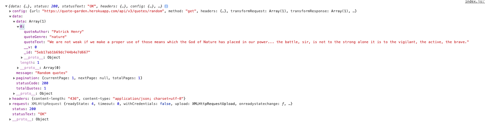
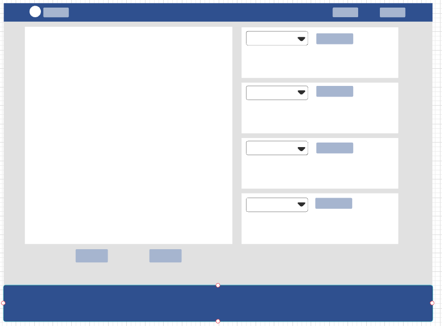
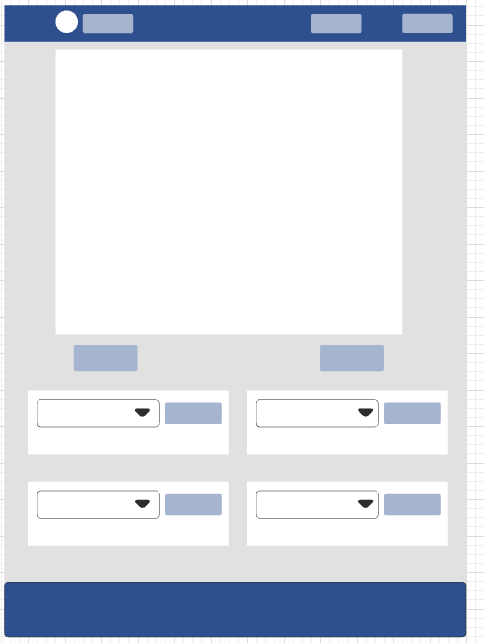
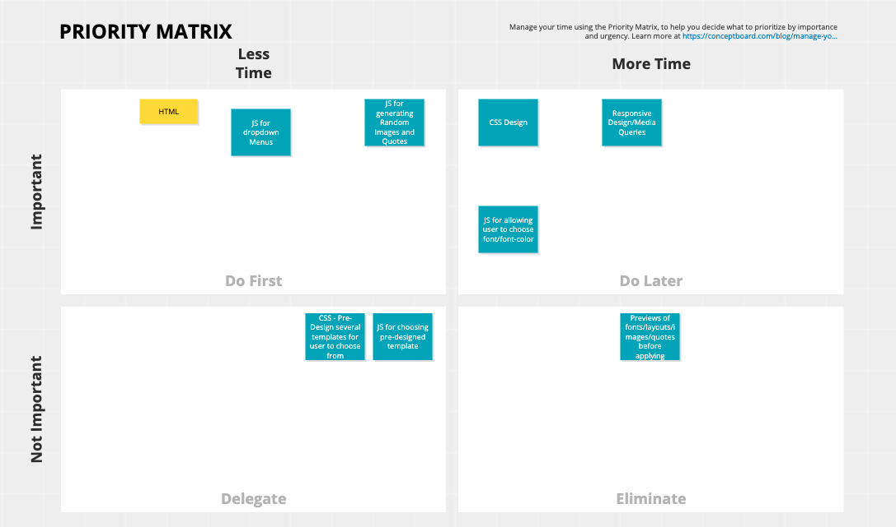

# Inspirational-Poster-Creator

# Project Overview

## Project Name
Inspirational Poster Creator

## Project Description
App allows user to create motivational posters.  User can choose from preselected themes to generate a random background image, and preselected genres to generate a random quote.  User can between several pre-set layouts as well as fonts and can choose font-color.

## API and Data Sample
API: QuoteGarden
API (possible): Unsplash
API (possible): Google Fonts Developer API

## API Snippet: 

## Wireframes

### MVP/PostMVP
 
#### MVP 
Web App will allow users to create digital inspirational posters with randomized quotes and images by: 
Web app will allow users to choose a quote genre and randomly genenerate an inspirational quote using the quotegarden API; users may refresh quote or choose a different theme at any time.
It will then allow users to choose an image theme and randomly generate a background image for their poster, either using the Unsplash API or a randomly generated Unsplash url. 

#### PostMVP  
Users will be able to refine their posters by:
Users will be able to pick a font - either from an array of preselected fonts or using a randomly generated list from the Google Fonts Developers API (random list can be regenerated for a new list of possible fonts) - and a font color;
Last, users will be able to select a layout from an array of pre-built layouts. 

## Project Schedule

|  Day | Deliverable | Status
|---|---| ---|
|Jun 8| HTML / JS for dropdown menus / JS for random images & quotes | Incomplete
|Jun 9| Debug Day 1 / Style CSS | Incomplete
|Jun 10| Responsive Design / @media queries| Incomplete
|Jun 11| HTML and JS for PostMVP features | Incomplete
|Jun 12-13| refine CSS / add CSS effects | Incomplete
|Jun 14| Presentations | Incomplete

## Priority Matrix

## Timeframes
| Component | Priority | Estimated Time | Time Invested | Actual Time |
| --- | :---: |  :---: | :---: | :---: |
| HTML Framework | H | 3hr| -- | -- |
| JS for Dropdown Menus | H | 1hr | -- | -- |
| JS for Random Images | H | 1hr | -- | -- |
| JS for Random Quotes | H | 1hr | -- | -- |
| Basic CSS Styling| H | 4hr | -- | -- |
| CSS Pre-Styling Layouts | H | 3hr | -- | -- |
| JS for Layouts | H | 1hr | -- | -- |
| Finding Fonts | H | 2hr | -- | -- |
| CSS and JS for user font-choices | H | 3hr | -- | -- |
| Resposive Design | H | 4hr | -- | -- |
| CSS effects | H | 2hr | -- | -- |
| Research and Learning New Techniques | H | 4hr | -- | -- |
| Experimenting | H | 4hr | -- | -- |
| Debugging | H | 6hr | -- | -- |
| Flex Time | H | 9hr | -- | -- |
| Total | H | 48hrs| -- | -- |

